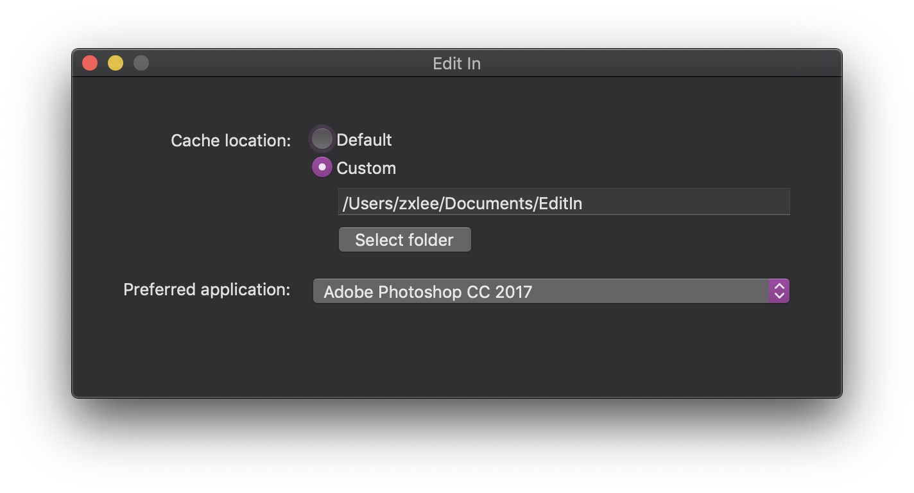
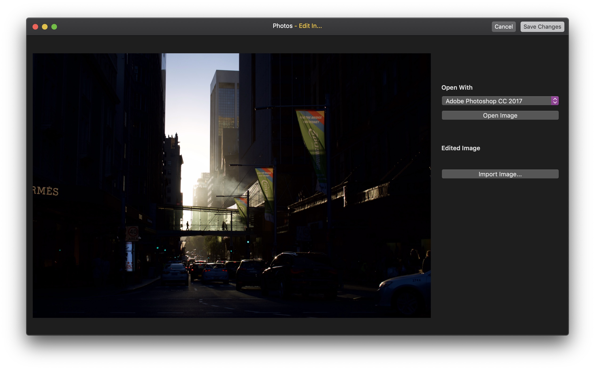

# Edit In

Edit In is a macOS Photos Editing extension that allows you to edit your photos in other applications like Photoshop.

## Why I wrote this?
I shoot RAW on my DSLR and use the Photos app on macOS to manage them because I would like my photos be backed up to iCloud. 
Apple has made the editing tools in the latest Photos more capable than previous releases but it is still difficult for me 
to tune my photos to my liking. I still prefer to Edit them in Lightroom / Adobe Camera Raw in Photoshop.  

The Photos app has a build in function that allows us to edit photos with third party applications but it converts the photos 
into a JPEG or TIFF. This makes shooting RAW pointless. I thought there must be a way to fix this problem, so I started 
reading the Developer Documentation and then wrote this simple application.

This is my very first macOS app, so, things might be broken. Let me know in case you found anything broken.

## How can I use this?
1. Download the zip file.
2. Drag it in to `/Application`.
3. Open it. Change the cache location if you want. (Preferrably on the disk where your photo library is located)
4. In `System Preferences` -> `Extensions` -> `Photo Editing`, make sure "Edit In..." is enabled.
5. Open a photo in the Photos application, enter the edit mode.
6. Click the `...` button on the upper right to edit the photo with the extension.
7. Select the application which you want to use to edit the photo, then click 'Open Image'
8. Edit your photo and save it as a JPEG when your're done.
9. Go back to the Photos application and click 'Import Image' to import the edited photos.
10. Done.

## How it works?
1. When you click 'Open Image', it copies the original full size image to the cache location that you've selected.
   That is why the same disk is preferred. APFS's copy-on-write feature allows us to duplicate files instantly.
2. It then asks the OS to open the image with the application you've selected.
3. When you're done editing, importing the image will tell the application the URL of the edited image. It then
   copies the edited image into `renderedContentURL` provided by PhotoKit.
4. Tada! The edited photo is now saved in your photo library.

## For Adobe Camera Raw Users
To achieve non-destructive editings or resume a previous edit, please make sure that you do this:
1. Open Adobe Camera Raw, go to 'Preferences'.
2. Make sure or change the 'Save image settings in:' option to 'Camera Raw database'.
3. Now you edit a photo, export, close and then reopen it and all the settings will still be there.
   Adobe Camera Raw is smart enough to recognise the original photo even if it has been moved to another location.

Note: If you ever need to change a computer, you should just copy the Camera Raw database at 
`~/Library/Preferences/Adobe Camera Raw Database` to your new computer and everything should just work as it used to be

